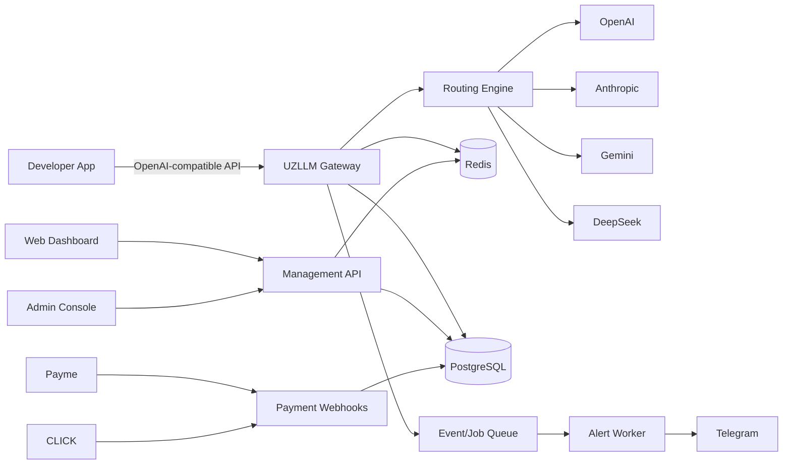
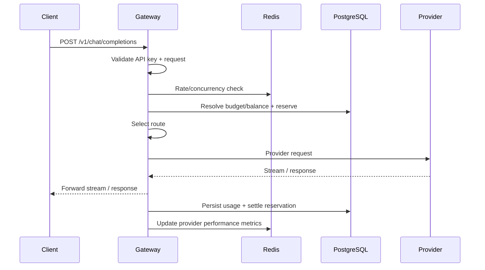
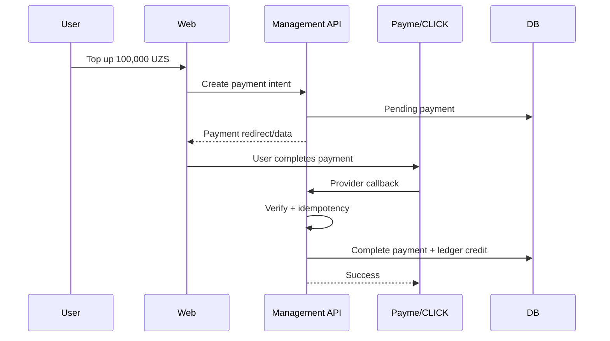

# System Design

## 1. Context diagram



---

## 2. High-level components

### 2.1 Gateway API

Hot path for inference.

Responsibilities:
- authenticate gateway key;
- resolve project/org;
- enforce limits and balance;
- validate request;
- resolve model;
- select provider;
- reserve spend;
- call upstream provider;
- stream response;
- collect usage;
- settle billing;
- emit metrics/events.

It should contain no UI-oriented behavior.

### 2.2 Management API

Control plane.

Responsibilities:
- auth/session;
- organizations;
- projects;
- API keys;
- models;
- provider keys;
- wallet;
- payments;
- usage queries;
- alerts;
- team;
- admin operations.

### 2.3 Workers

Responsibilities:
- alert delivery;
- payment reconciliation;
- provider health probing;
- model/pricing synchronization;
- usage rollups;
- outbox processing;
- expired reservation cleanup;
- report exports.

### 2.4 PostgreSQL

System of record for:
- accounts/orgs;
- projects;
- keys;
- wallet ledger;
- payments;
- provider/model config;
- request/usage metadata;
- audit records.

### 2.5 Redis

Use for:
- distributed rate limits;
- concurrency counters;
- short-lived model/provider cache;
- provider health/routing stats;
- response cache P1;
- hot configuration snapshots.

Redis must not be the financial source of truth.

---

## 3. Control plane vs data plane

### Control plane

```text
Dashboard -> Management API -> PostgreSQL
```

Changes:
- create key;
- change budget;
- add BYOK;
- enable model;
- configure alert.

### Data plane

```text
Client -> Gateway API -> Router -> Provider
```

The data plane should remain fast even if some analytics/control operations are degraded.

---

## 4. Inference request sequence



For throughput, some metadata may be buffered asynchronously, but the **financial reservation/capture invariants must remain safe**.

---

## 5. Payment sequence



Payment and ledger credit must commit atomically when possible inside one DB transaction.

---

## 6. Deployment topology

### MVP

```text
Internet
  |
Cloudflare/WAF (optional)
  |
Nginx / Load Balancer
  |
  +--> Gateway API x N
  +--> Management API x N
  +--> Frontend static app
  +--> Worker x N

PostgreSQL
Redis
Object storage (exports, optional)
```

### Why separate Gateway and Management processes?

Because inference has different:
- traffic volume;
- timeout profile;
- streaming behavior;
- scaling requirements;
- failure modes.

---

## 7. Why not microservices first?

Billing, routing, users and projects are tightly evolving domains at MVP stage.

Microservices would add:
- distributed transactions;
- many deployments;
- network debugging;
- duplicated auth/observability;
- more DevOps cost.

Recommended rule:

> Modularize in code first; split a module only when independent scaling/team/reliability needs are proven.

Likely future split candidates:
- Billing;
- Usage Analytics;
- Payments;
- Notifications.

---

## 8. Corrected managed inference flow

Gateway, Management, and Worker are independently deployed hosts that compile
the same bounded modules; `Application/Domain` is not a fourth network service.
The Worker uses PostgreSQL outbox records and leased jobs, not a mandatory
external event queue.

```text
authenticate → rate/concurrency admission → validate → build eligible routes
→ freeze price/fee bound → atomically reserve wallet and budgets → dispatch
→ stream/normalize → persist usage evidence → settle or reconcile
```

Do not retain database locks or transactions while calling an upstream provider.
Gateway and Management use independently bounded database pools so analytics or
control-plane load cannot exhaust inference admission capacity. A PostgreSQL
outage closes new managed admission; Redis failure closes distributed admission.
